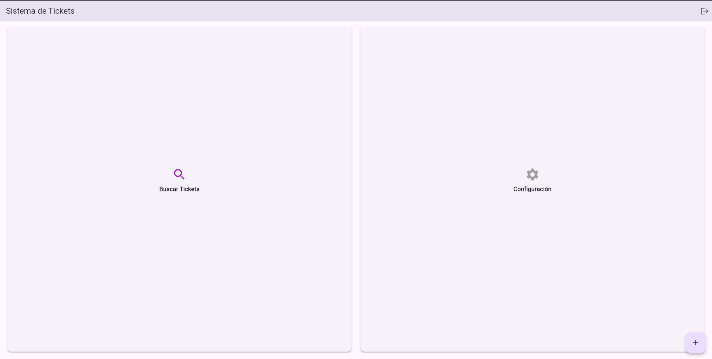
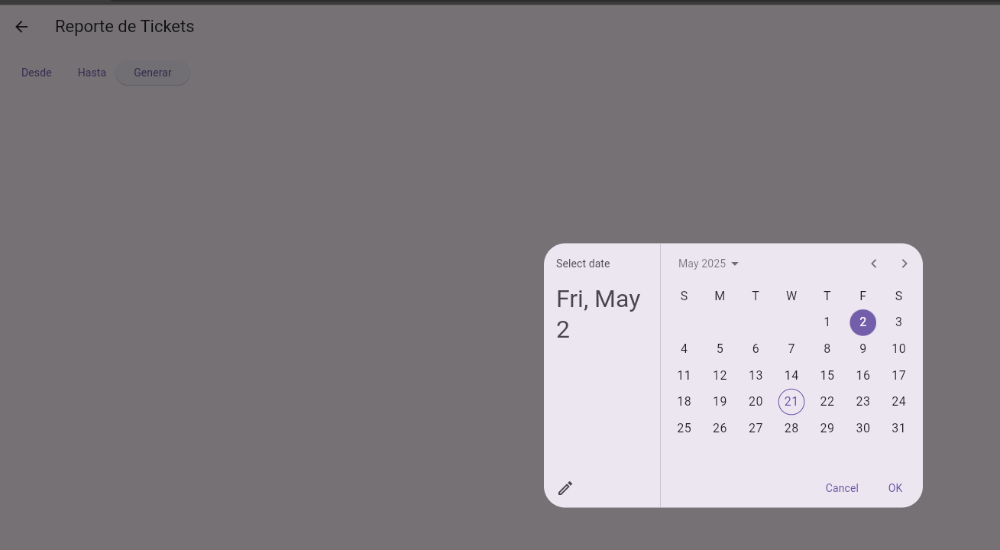
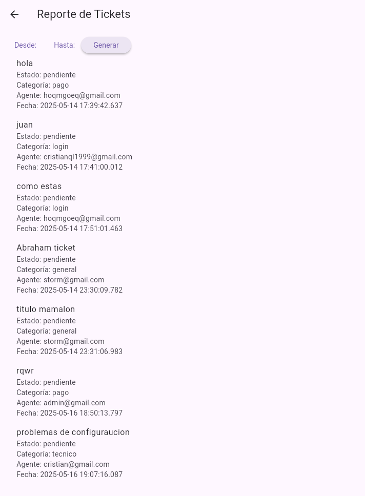

# SM2_EXAMEN_PRACTICO

## Descripción del Proyecto
Este proyecto tiene como objetivo la creación de un sistema de soporte para gestionar tickets y generar reportes sobre el desempeño del equipo de soporte. El sistema consta de dos funcionalidades principales:

1. **Creación y gestión de tickets**: Los usuarios pueden registrar nuevos tickets con detalles sobre el problema que necesitan solucionar.
2. **Generación de reportes**: Los administradores pueden generar reportes basados en diversos criterios (fecha, tipo de problema, agente).

## Pre requisitos

Utilizaremos el comando:
flutter doctor
para comprobar que tenemos todo disponible, si todos los prerequisitos están listos. Por ejemplo, Android studio. (tambien podemos usar flutter upgrade para actualizar Flutter o sus herramientas)

Y con el comando:
flutter pub get
Podremos cargar todo flutter correctamente y empezar

## Funcionalidades Implementadas

### 1. Creación y gestión de tickets
   **Historia de Usuario:** *Como usuario, quiero poder registrar un nuevo ticket con la información del problema, para solicitar soporte y recibir asistencia.*
   
   **Detalles:**
   - Los usuarios pueden ingresar detalles como tipo de problema, descripción y prioridad.
   - El sistema asigna automáticamente un identificador único a cada ticket.
   - Se puede crear un usuario y luego probar la funcionalidad.
   - Ejemplo de usuario: "roro". password: "123456".
     
Al loguear como un usuario, podremos ver las diferentes opciones para gestionar nuestros tickets.

Con la opcion de crear ticket, crearemos nuestros tickets.

### 2. Generación de reportes
   **Historia de Usuario:** *Como administrador, quiero generar reportes sobre los tickets atendidos (por fecha, tipo de problema, agente), para analizar el desempeño del equipo de soporte.*

   **Detalles:**
   - Los administradores pueden generar reportes filtrados por fecha, tipo de problema y agente asignado.
   - Los reportes están disponibles en formato descargable (PDF/Excel).
   - Ejemplo de usuario: "admin", password: "admin123".

Una vez que logueemos con usuario admin, entraremos a su interfaz.

En la esquina superior derecha, encontraremos la opcion de "Reporte"

Una vez alli podremos filtrar por fechas.

Y finalmente generaremos un reporte con los datos de los tickets filtrados.

## Enlaces y Referencias

## URL del Repositorio en GitHub
[Examen Práctico](https://github.com/RodrigoDLCC/SM2_EXAMEN_PRACTICO.git)
# SM2_EXAMEN_PRACTICO